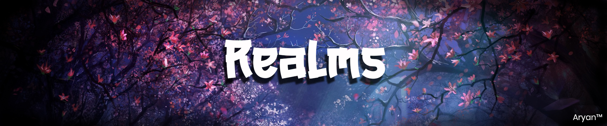

<h1 align="center">
   
  
   
  Dragon Realms
   
</h1>

Dragon Realms also known as Realms is a Game and software Development Organisation. Founded on 2nd November 2020 by [Ravanger101.](https://github.com/Ravanger101) We are here to
develop the best of best Applications for the Community with the help of Community. Everyone is free to contribute and work on a Project!

## Popular Projects:
- [Le Caddie`](https://github.com/ProjectDragonRealms/Le-Caddie-#readme)
- [Pokemon Python Red](https://github.com/ProjectDragonRealms/Pokemon-PythonRed/releases/tag/v1.0.0)
- [Inu Yoshikawa BM v1](https://github.com/ProjectDragonRealms/Inu-Yoshikawa.V.1.0.Benchmark#readme)
- [Minecraft Classic Py Version 1.0](https://github.com/ProjectDragonRealms/MinecraftClassicPYVersion1.0)

## [Discussions](https://github.com/orgs/ProjectDragonRealms/discussions)
@ Copyright [Ravanger101](https://github.com/Ravanger101)

